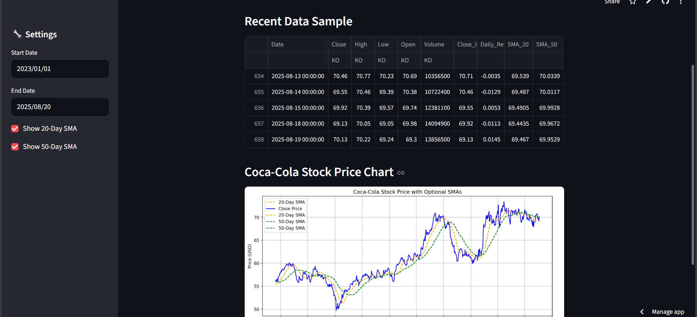

#  Coca-Cola Stock Price Predictor

This Streamlit app uses a trained **Random Forest model** to predict the next closing price of **Coca-Cola (KO)** stock using live data from Yahoo Finance.

🔗 **Live Demo:** [Coca-Cola Stock Predictor](https://cocacolastockprediction-djybmwvzrinclqxkmn5ykt.streamlit.app/)

---

##  Features

-  Real-time data fetching via `yfinance`  
-  Feature engineering (SMA, lag, returns)  
-  Interactive controls (date selector, SMA toggles)  
-  Easy deployment on Streamlit Cloud  

---

##  Model

- Algorithm: **Random Forest Regressor**  
- Training Data: **2015–2025**  
- Features used:  
  - `Close_Lag1`  
  - `SMA_20`  
  - `SMA_50`  
  - `Daily_Return`  

---

##  Application Screenshot  

Here’s a preview of the app in action:



---

##  How It Works  

1. **Data Fetching** → Live Coca-Cola stock data is pulled from Yahoo Finance.  
2. **Feature Engineering** → Generates features like lagged close price, moving averages (SMA20, SMA50), and daily returns.  
3. **Prediction** → Random Forest model predicts the next day’s closing price.  
4. **Visualization** → Displays historical data, technical indicators, and predicted price in the Streamlit app.  

---

##  Installation

Clone the repo and run locally:

```bash
git clone https://github.com/aditig190/coca_cola_stock_prediction
cd cocacola-stock-predictor
pip install -r requirements.txt
streamlit run app.py
